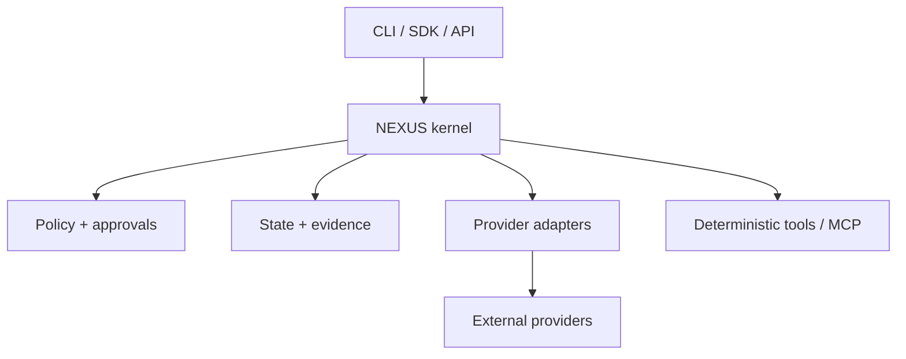
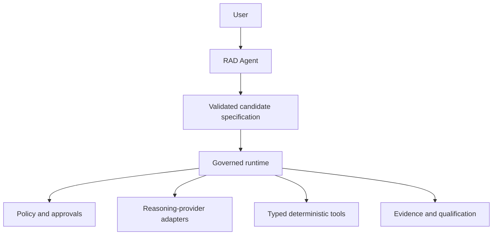

# Architecture

NEXUS is a modular control plane. Public surfaces invoke application services;
services validate configuration and compile a canonical DAG; the runtime schedules
tasks through policies, approvals, sandboxes, tools, and provider adapters. Every
meaningful transition and verification emits telemetry and chained evidence.

The kernel owns orchestration semantics; adapters own vendor translation; tools
own bounded actions; stores own transactional persistence. Mode packs compile
domain work but do not fork the kernel. All boundary objects are versioned and
schema-validated.

The initial deployment is a single process with durable SQLite storage and local
artifact files constrained to a workspace. Interfaces permit later separation into
workers, PostgreSQL, object storage, and remote sandboxes without changing the
domain protocol. Distribution is deferred until correctness and recovery semantics
are proven locally.

Key flows are validate -> canonicalize -> plan -> policy preview -> execute ->
verify -> evidence -> qualify. Approval pauses are durable. Recovery reconstructs
state from the store and resumes only compatible, leased, idempotent work.

## RAD Agent boundary

RAD Agent is the product layer above the control plane. It converts conversation
into a candidate specification but cannot directly execute tools or authorize work.
Reasoning providers remain behind adapters and may be local or hosted.

The model-to-tool edge is deliberately absent. ADR-0003 governs this separation.
